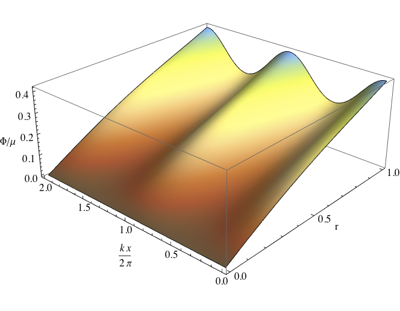
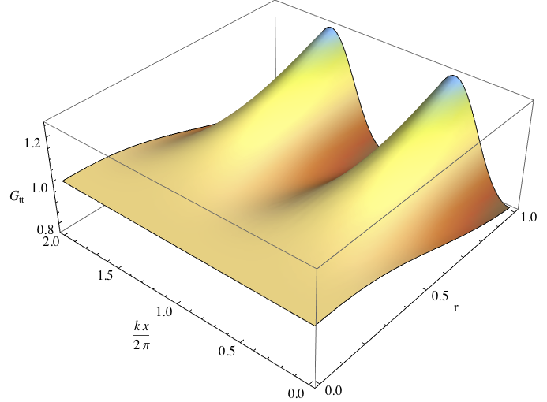
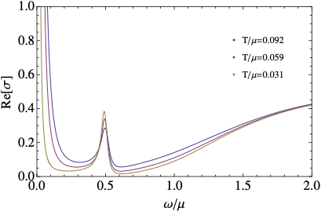

# Holographic Lattice Conductivity

Here you will find the code I wrote to generate the data presented in ["The thermoelectric properties of inhomogeneous holographic lattices"](https://arxiv.org/abs/1409.6875) by A. Donos and J. Gauntlett. The paper studies the transport properties of inhomogeneous black brane solutions which are dual to field theories with periodic deformations that break translations.

The Black Brane Solutions
  ---
  The background black holes produced are four dimnsional with the spacetime having two Killing vectors (symmetries). The ansatz for the metric and matter fields was based on functions that depend on the holographic radial direction as well as on a spatial direction of the boundary field theory. After all, these black branes break one of the field theory translations!
  
<figure>

</figure>

   Figure shows plots of the functions $\Phi$ and $G_{tt}$ parametrising the background ansatz for fixed temeprature, chemical potential and scalar operator deformations. The resulting functions are periodic in the direction of the lattice. The backgrounds can be constructed using the program in the folder ["OpticalConductivity"](OpticalConductivity/main.cpp).

Optical Conductivity
---
The second component of the code can compute the necessary perturbations in order to evaluate transport properties of the lattice. In the paper we chose to consider the electric optical conductivity.

<figure>

</figure>

Libraries
---
The code is in C++ and it requires the libraries:
1) [Eigen](https://eigen.tuxfamily.org/index.php?title%253DMain_Page)

   Mostly used to store and manipulate the Hessian operator in Newton's method implementation. Also used its linear solvers for the flavour of the code that uses high precision numerics.

2) [Intel MKL](https://www.intel.com/content/www/us/en/developer/tools/oneapi/onemkl.html)

   Used the functionality of PARDISO_64 to find the inverse of the Hessian in Newton's method when using 64-bit floats. Especially powerfull when the Hessian is sparse (e.g. finite differences).

3) [Mpreal](https://github.com/advanpix/mpreal)

   Multiple precision arithetic library used to perform computations at arbitrary numerical precision.

4) [Boost](https://www.boost.org/)

   Used for higher precision numerics.

To compile the project, I have included a makefile to be used with Intel's C++ compiler. You might have to modify that depending on where your libraries are located and the distribution of C++ you are using. Note that in that makefile I am also linking to the [Suitespase](https://people.engr.tamu.edu/davis/suitesparse.html) libraries. This is because ["NewtonMethod"](NewtonMethod.cpp) has two separate implementations for inverting the Hessian in Newton's method. By default, I have commented out the implementation based on Suitesparse. I have found that Intel's solvers perform slightly better for this problem when using spectral methods. Feel free to experiment yourself!

What and Where
---
The folder structure of the repository is:

 * *Mathematica*

   Contains the Mathematica notebooks I used to write the equations of motion of Einstein-Maxwell-Dilaton including the DeTurck trick term in Einstein's equations. The subfolder "Background" contains the notebooks concerning the background geometries. The subfolder "Conductivity" contains the notebooks for the equations governing the computation of the optical conductivity.
   
   In case you find it useful, I have included the notebooks Thermo and CNotebook. These are used to manipulate the data and extract boundary theory quantities for the backgrounds and the conductivity perturbation respectively. Moreoever, they are used to generate the differentiation matrices for both finite differences as well as spectral methods.

 * *Sourcefiles*

   The above mentioned notebooks output the equations of motion and boundary conditions in C files. These need to moved to the folder "Sourcefiles" when compiling.

* *Background*

  The program that constructs the gravitational backgrounds which are dual to a explicit lattice configuration on the conformal boundary field theory.

* *Perturbation*

   The program that computes the optical conductivities of the holographic lattice.
